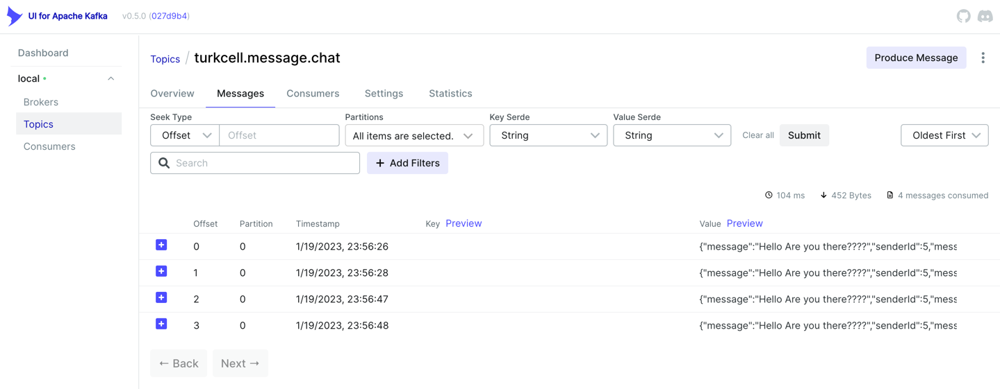

# Kafka-UI

Kafka-UI without zookeeper

## Features

- Full dockerize application
- Kafka messaging
- Kafka ui  (localhost:8082)


## Tech Stack

Java 17  
Spring Boot 2.7.5  
Lombok  
OpenApi 1.6.14  
Kafka  
Docker

## Run App

To run app, run the following command

```bash
  docker compose up
```

## API Reference

#### Send message to topic

```http
  POST /api/v1/hello
```

| Parameter      | Type           | Description                          |
| :------------- | :------------- |:-------------------------------------|
| `helloRequest` | `HelloRequest` | message object you are about to send |


## Screenshots
localhost:8082



## Authors

- [@oguzcan](https://www.github.com/grotders)

